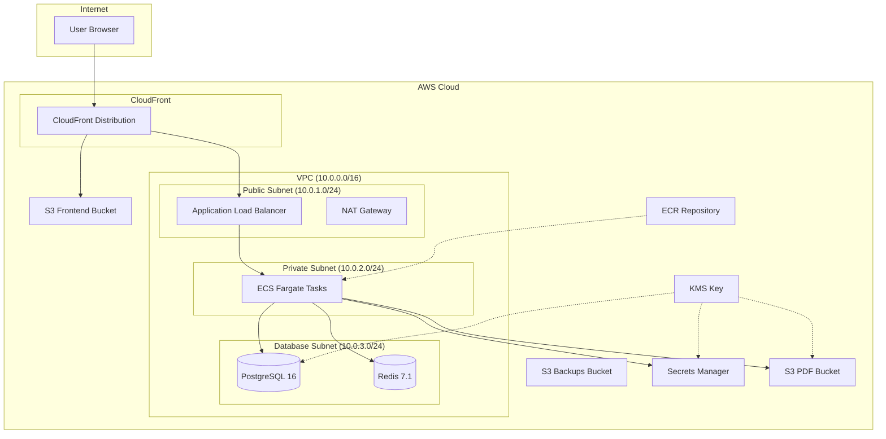

# Architecture Overview

This document describes the architecture of the Astro infrastructure deployed on AWS.

## High-Level Architecture



## Network Architecture

### VPC Design (Single-AZ for Cost Optimization)

```
VPC: 10.0.0.0/16 (65,536 IPs)
├── Public Subnet: 10.0.1.0/24 (256 IPs)
│   ├── Internet Gateway (ingress/egress)
│   ├── NAT Gateway (outbound for private subnet)
│   └── Application Load Balancer
│
├── Private Subnet: 10.0.2.0/24 (256 IPs)
│   └── ECS Fargate Tasks
│       └── Outbound via NAT Gateway
│
└── Database Subnet: 10.0.3.0/24 (256 IPs)
    ├── RDS PostgreSQL
    └── ElastiCache Redis
        └── No internet access (isolated)
```

### Security Groups

| Security Group | Inbound | Outbound | Purpose |
|---------------|---------|----------|---------|
| ALB | 80, 443 from 0.0.0.0/0 | ECS:8000 | Load balancer |
| ECS | 8000 from ALB SG | All to 0.0.0.0/0 | API containers |
| RDS | 5432 from ECS SG | None | Database |
| Redis | 6379 from ECS SG | None | Cache |

## Data Flow

### Frontend Request Flow

```
1. User requests app.astro.com
2. DNS resolves to CloudFront
3. CloudFront serves from S3 (React SPA)
4. SPA makes API calls to api.astro.com
5. CloudFront routes /api/* to ALB
6. ALB forwards to ECS Fargate task
```

### API Request Flow

```
1. Request hits ALB (HTTPS terminated)
2. ALB health checks ECS tasks
3. Request forwarded to healthy ECS task
4. FastAPI processes request:
   ├── Auth: Check JWT (from Secrets Manager)
   ├── Cache: Check Redis (ElastiCache)
   ├── DB: Query PostgreSQL (RDS)
   └── Storage: Read/Write S3 (PDFs)
5. Response returned through ALB → CloudFront → User
```

## Module Dependency Graph

```
bootstrap (standalone - run first)
    └── Creates S3 bucket + DynamoDB for Terraform state

vpc (base infrastructure)
    ├── rds (needs db_subnet_group, rds_security_group)
    ├── elasticache (needs elasticache_subnet_group, redis_security_group)
    ├── ecs (needs public_subnet, private_subnet, security_groups)
    └── s3 (no VPC dependency, but logical grouping)

secrets (depends on ecs)
    └── Uses ECS role ARNs for KMS key policy

ecs (depends on vpc, secrets, s3, ecr)
    ├── References secret ARNs in task definition
    ├── Attaches S3 access policy to task role
    └── Pulls images from ECR

ecr (standalone)
    └── Provides repository URL for ECS

cloudfront (standalone)
    └── Creates OAC for S3 access

dns (depends on cloudfront, ecs)
    ├── Creates CloudFront alias record
    ├── Creates ALB alias record
    └── Provisions ACM certificates
```

## Security Architecture

### Encryption

| Layer | Encryption | Key Management |
|-------|------------|----------------|
| Data at Rest (S3) | AES-256 | AWS KMS (CMK) |
| Data at Rest (RDS) | AES-256 | AWS Managed |
| Data at Rest (Redis) | AES-256 | AWS Managed |
| Data in Transit | TLS 1.2+ | ACM Certificates |
| Secrets | AES-256 | AWS KMS (CMK) |

### IAM Roles

```
ECS Execution Role (astro-{env}-ecs-execution-role)
├── Pull images from ECR
├── Write logs to CloudWatch
├── Read secrets from Secrets Manager
└── Decrypt with KMS

ECS Task Role (astro-{env}-ecs-task-role)
├── ECS Exec (SSM for debugging)
├── Write to CloudWatch Logs
├── Read/Write to S3 (PDFs)
└── Decrypt/Encrypt with KMS
```

### Network Security

- All subnets are private except for ALB
- NAT Gateway provides controlled outbound access
- Security groups follow least-privilege principle
- No public IPs on ECS tasks or databases
- VPC Flow Logs enabled (optional)

## Availability and Resilience

### Current Design (Dev - Single AZ)

| Component | Availability | Recovery |
|-----------|-------------|----------|
| ECS Tasks | Single AZ, Spot | Auto-restart, ~30s |
| RDS | Single AZ | Automated backups, PITR |
| ElastiCache | Single node | Restart, data loss |
| ALB | Multi-AZ | Automatic |
| CloudFront | Global | Automatic |
| S3 | 99.999999999% | Automatic |

### Production Design (Multi-AZ)

For production, the architecture can be extended to:
- 3 Availability Zones
- RDS Multi-AZ with failover
- ElastiCache Redis with replicas
- Multiple NAT Gateways
- ECS tasks spread across AZs

## Component Details

### ECS Fargate (Spot)

- **Image**: FastAPI application from ECR
- **CPU**: 0.25 vCPU (256 units)
- **Memory**: 512 MB
- **Capacity Provider**: FARGATE_SPOT (~70% cost savings)
- **Desired Count**: 1 (dev), 2+ (prod)

### RDS PostgreSQL

- **Engine**: PostgreSQL 16
- **Instance**: db.t3.micro (2 vCPU, 1 GB RAM)
- **Storage**: 20 GB gp3 (auto-scaling to 100 GB)
- **Backup**: 7-day retention, daily snapshots
- **PITR**: Enabled (5-minute granularity)

### ElastiCache Redis

- **Engine**: Redis 7.1
- **Node**: cache.t3.micro (2 vCPU, 0.5 GB RAM)
- **Purpose**: Rate limiting, session cache, Celery broker
- **Persistence**: None (cache only)

### CloudFront + S3

- **Origin**: S3 bucket with OAC
- **Price Class**: PriceClass_100 (US, Canada, Europe)
- **SSL**: ACM certificate (auto-renewed)
- **Caching**: 1 hour (dev), 24 hours (prod)

## Cost Summary

| Component | Dev (Single AZ) | Prod (Multi-AZ) |
|-----------|-----------------|-----------------|
| ECS Fargate (Spot) | ~$6/mo | ~$50-100/mo |
| RDS PostgreSQL | ~$13/mo | ~$100-200/mo |
| ElastiCache Redis | ~$12/mo | ~$50-100/mo |
| NAT Gateway | ~$35/mo | ~$105/mo (3 AZs) |
| ALB | ~$20/mo | ~$20/mo |
| CloudFront + S3 | ~$2/mo | ~$20-50/mo |
| Other | ~$10/mo | ~$20/mo |
| **Total** | **~$98/mo** | **~$365-595/mo** |

---

*Last updated: 2025-12-26*
