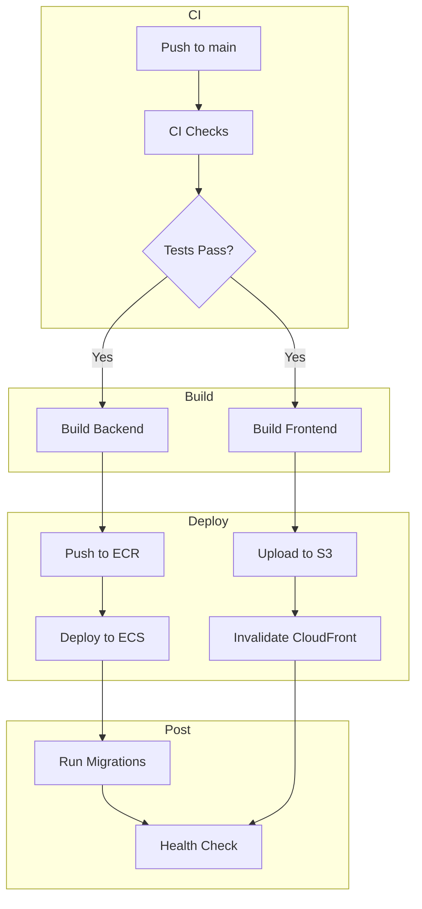

# Deployment Guide

Comprehensive guide for deploying infrastructure and applications to the Astro platform.

## Deployment Types

| Type | Description | Trigger |
|------|-------------|---------|
| **Infrastructure** | Terraform resources (VPC, RDS, ECS, etc.) | Manual via `terraform apply` or PR merge |
| **Application** | API and frontend code | Push to `main` branch |
| **Rollback** | Revert to previous version | Manual via ECS console or CLI |

---

## Infrastructure Deployment

### Pre-Deployment Checklist

- [ ] Credentials loaded: `source scripts/init-backend.sh`
- [ ] Working on correct environment: `pwd` shows `iac/environments/{env}`
- [ ] Branch is up to date: `git pull`
- [ ] Review changes: `terraform plan`
- [ ] No sensitive values in commits

### Manual Deployment

```bash
# 1. Navigate to environment
cd iac/environments/dev

# 2. Load AWS credentials
source ../../scripts/init-backend.sh

# 3. Initialize Terraform
terraform init

# 4. Review changes
terraform plan

# 5. Apply changes
terraform apply
```

### CI/CD Deployment (Recommended)

Infrastructure changes are deployed via GitHub Actions:


#### Workflow: terraform-plan.yml

Runs on PRs that modify `iac/**`:
- Validates Terraform configuration
- Generates execution plan
- Posts plan as PR comment

#### Workflow: terraform-apply.yml

Runs on merge to `dev` or `main`:
- Applies Terraform changes
- Updates infrastructure

---

## Application Deployment

### Production Pipeline



### GitHub Actions Workflow

The production deployment (`deploy-prod.yml`) performs:

1. **CI Checks**: Lint, type check, tests
2. **Build Backend**: Docker build, push to ECR
3. **Build Frontend**: npm build, upload artifact
4. **Deploy Backend**: Update ECS task definition
5. **Deploy Frontend**: Sync to S3, invalidate CloudFront
6. **Run Migrations**: Alembic upgrade via ECS Exec
7. **Health Check**: Verify API is responding

### Required GitHub Secrets

| Secret | Description | Example |
|--------|-------------|---------|
| `AWS_ACCESS_KEY_ID` | AWS credentials | `AKIA...` |
| `AWS_SECRET_ACCESS_KEY` | AWS credentials | `wJal...` |
| `ECS_CLUSTER_NAME` | ECS cluster name | `astro-prod-cluster` |
| `ECS_SERVICE_NAME` | ECS service name | `astro-prod-api` |
| `ECR_REPOSITORY_NAME` | ECR repo name | `astro-api` |
| `FRONTEND_BUCKET_NAME` | S3 bucket | `astro-prod-frontend-...` |
| `CLOUDFRONT_DISTRIBUTION_ID` | CloudFront ID | `E1234ABCD` |
| `VITE_API_URL` | API URL | `https://api.example.com` |

### Manual Application Deployment

#### Backend (ECS)

```bash
# 1. Build and push Docker image
cd apps/api
docker build -t astro-api:latest .

# 2. Tag for ECR
aws ecr get-login-password --region us-east-1 | docker login --username AWS --password-stdin 123456789.dkr.ecr.us-east-1.amazonaws.com
docker tag astro-api:latest 123456789.dkr.ecr.us-east-1.amazonaws.com/astro-api:latest
docker push 123456789.dkr.ecr.us-east-1.amazonaws.com/astro-api:latest

# 3. Force new deployment
aws ecs update-service \
  --cluster astro-prod-cluster \
  --service astro-prod-api \
  --force-new-deployment
```

#### Frontend (S3/CloudFront)

```bash
# 1. Build frontend
cd apps/web
npm run build

# 2. Sync to S3
aws s3 sync dist/ s3://astro-prod-frontend-xyz/ --delete

# 3. Invalidate CloudFront
aws cloudfront create-invalidation \
  --distribution-id E1234ABCD \
  --paths "/*"
```

---

## Database Migrations

### Automatic (via CI/CD)

Migrations run automatically after ECS deployment:

```yaml
- name: Run Alembic migrations
  run: |
    aws ecs execute-command \
      --cluster ${{ env.ECS_CLUSTER }} \
      --task $TASK_ARN \
      --container astro-api \
      --command "alembic upgrade head"
```

### Manual Migrations

```bash
# 1. Get running task ARN
TASK_ARN=$(aws ecs list-tasks \
  --cluster astro-dev-cluster \
  --service-name astro-dev-api \
  --desired-status RUNNING \
  --query 'taskArns[0]' \
  --output text)

# 2. Run migration
aws ecs execute-command \
  --cluster astro-dev-cluster \
  --task $TASK_ARN \
  --container astro-api \
  --interactive \
  --command "alembic upgrade head"
```

### Migration Rollback

```bash
aws ecs execute-command \
  --cluster astro-dev-cluster \
  --task $TASK_ARN \
  --container astro-api \
  --interactive \
  --command "alembic downgrade -1"
```

---

## Rollback Procedures

### Rollback Application (ECS)

#### Option 1: Redeploy Previous Image

```bash
# Find previous image tag
aws ecr describe-images \
  --repository-name astro-api \
  --query 'sort_by(imageDetails,& imagePushedAt)[-5:].imageTags' \
  --output table

# Update task definition with previous tag
# Then force new deployment
aws ecs update-service \
  --cluster astro-prod-cluster \
  --service astro-prod-api \
  --force-new-deployment
```

#### Option 2: Use Previous Task Definition

```bash
# List task definition revisions
aws ecs list-task-definitions \
  --family-prefix astro-prod-api \
  --sort DESC

# Update service to use previous revision
aws ecs update-service \
  --cluster astro-prod-cluster \
  --service astro-prod-api \
  --task-definition astro-prod-api:42  # Previous revision
```

### Rollback Frontend

```bash
# S3 versioning allows recovery
aws s3api list-object-versions \
  --bucket astro-prod-frontend-xyz \
  --prefix index.html

# Restore specific version
aws s3api copy-object \
  --bucket astro-prod-frontend-xyz \
  --copy-source "astro-prod-frontend-xyz/index.html?versionId=abc123" \
  --key index.html

# Invalidate CloudFront
aws cloudfront create-invalidation \
  --distribution-id E1234ABCD \
  --paths "/index.html"
```

### Rollback Infrastructure

```bash
# Revert to previous state
git checkout HEAD~1 iac/

# Or specific commit
git checkout abc1234 iac/

# Apply previous state
cd iac/environments/dev
terraform apply
```

---

## Health Checks

### API Health Endpoint

```bash
curl https://api.example.com/health
# Expected: {"status": "healthy"}
```

### ECS Service Health

```bash
# Check service status
aws ecs describe-services \
  --cluster astro-prod-cluster \
  --services astro-prod-api \
  --query 'services[0].{status:status,runningCount:runningCount,desiredCount:desiredCount}'

# Check recent events
aws ecs describe-services \
  --cluster astro-prod-cluster \
  --services astro-prod-api \
  --query 'services[0].events[:5]'
```

### CloudWatch Logs

```bash
# Stream API logs
aws logs tail /ecs/astro-prod-api --follow

# Search for errors
aws logs filter-log-events \
  --log-group-name /ecs/astro-prod-api \
  --filter-pattern "ERROR" \
  --start-time $(date -d '1 hour ago' +%s000)
```

---

## Zero-Downtime Deployment

ECS is configured for zero-downtime deployments:

```hcl
deployment_configuration {
  maximum_percent         = 200  # Allow double capacity during deploy
  minimum_healthy_percent = 100  # Keep existing tasks running
}
```

### Deployment Flow

1. ECS starts new tasks with new image
2. ALB health checks pass on new tasks
3. ALB routes traffic to new tasks
4. Old tasks are drained and stopped

### Deregistration Delay

Tasks wait 30 seconds before removing from ALB:

```hcl
resource "aws_lb_target_group" "api" {
  deregistration_delay = 30  # Allow in-flight requests to complete
}
```

---

## Deployment Monitoring

### CloudWatch Dashboard

View real-time metrics during deployment:
- ECS task count
- CPU/Memory utilization
- ALB request count
- 4xx/5xx error rates

### CloudWatch Alarms

Automatic alerts for deployment issues:
- ECS task failures
- High error rate (>5%)
- Unhealthy host count
- Response time spike

### Deployment Notification

GitHub Actions posts deployment summary:

```markdown
## Deployment Summary
- **Commit:** abc1234
- **Branch:** main
- **Triggered by:** @developer
- **Status:** Success
```

---

## Troubleshooting Deployments

### ECS Deployment Stuck

```bash
# Check for deployment in progress
aws ecs describe-services \
  --cluster astro-prod-cluster \
  --services astro-prod-api \
  --query 'services[0].deployments'

# Cancel stuck deployment (force rollback)
aws ecs update-service \
  --cluster astro-prod-cluster \
  --service astro-prod-api \
  --force-new-deployment
```

### Task Fails to Start

```bash
# Check stopped task reason
aws ecs describe-tasks \
  --cluster astro-prod-cluster \
  --tasks $(aws ecs list-tasks --cluster astro-prod-cluster --service-name astro-prod-api --desired-status STOPPED --query 'taskArns[0]' --output text) \
  --query 'tasks[0].stoppedReason'
```

### Common Issues

| Issue | Cause | Solution |
|-------|-------|----------|
| Task won't start | Bad image | Check ECR, verify image exists |
| Health check fails | App not ready | Increase health check grace period |
| Deployment timeout | Slow startup | Increase startup time or resources |
| Out of memory | Memory limit | Increase task memory |
| Permission denied | IAM roles | Check task/execution role policies |

See [TROUBLESHOOTING.md](./TROUBLESHOOTING.md) for more details.

---

*Last updated: 2025-12-26*
