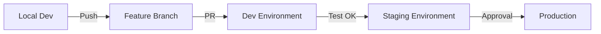

# Environment Configuration

Guide for managing different environments (dev, staging, prod) in the Astro infrastructure.

## Environment Overview

| Environment | Purpose | AZ | RDS | ECS Tasks | Cost |
|-------------|---------|-----|-----|-----------|------|
| **dev** | Development and testing | Single | db.t3.micro | 1 (Spot) | ~$98/mo |
| **staging** | Pre-production testing | Single | db.t3.small | 2 (Spot) | ~$150/mo |
| **prod** | Production workloads | Multi-AZ | db.t3.medium | 3+ | ~$400/mo |

## Directory Structure

```
iac/
├── environments/
│   ├── dev/           # Development environment
│   │   ├── main.tf
│   │   ├── variables.tf
│   │   ├── outputs.tf
│   │   └── terraform.tfvars  # (gitignored, optional)
│   ├── staging/       # Staging environment (future)
│   │   └── ...
│   └── prod/          # Production environment (future)
│       └── ...
└── modules/           # Shared modules
```

## Environment Comparison

### Compute Resources

| Setting | Dev | Staging | Prod |
|---------|-----|---------|------|
| `ecs_cpu` | 256 (0.25 vCPU) | 512 (0.5 vCPU) | 1024 (1 vCPU) |
| `ecs_memory` | 512 MB | 1024 MB | 2048 MB |
| `ecs_desired_count` | 1 | 2 | 3+ |
| Capacity Provider | FARGATE_SPOT | FARGATE_SPOT | FARGATE (70/30) |

### Database Resources

| Setting | Dev | Staging | Prod |
|---------|-----|---------|------|
| `db_instance_class` | db.t3.micro | db.t3.small | db.t3.medium+ |
| Multi-AZ | No | No | Yes |
| Backup Retention | 7 days | 14 days | 30 days |
| Delete Protection | No | No | Yes |
| PITR | Yes | Yes | Yes |

### Cache Resources

| Setting | Dev | Staging | Prod |
|---------|-----|---------|------|
| `redis_node_type` | cache.t3.micro | cache.t3.small | cache.t3.medium+ |
| Cluster Mode | Single node | Single node | Replication |
| Snapshot Retention | 0 | 1 day | 7 days |

### Network

| Setting | Dev | Staging | Prod |
|---------|-----|---------|------|
| Availability Zones | 1 (us-east-1a) | 1 | 3 (a, b, c) |
| NAT Gateways | 1 | 1 | 3 |
| VPC Flow Logs | Optional | Yes | Yes |

### Storage

| Setting | Dev | Staging | Prod |
|---------|-----|---------|------|
| S3 Versioning | Yes | Yes | Yes |
| S3 Lifecycle | 30 days | 60 days | 90 days |
| Force Destroy | Yes | Yes | No |
| Logs Bucket | No | Yes | Yes |

---

## Creating a New Environment

### Step 1: Copy Dev Environment

```bash
cd iac/environments
cp -r dev staging
cd staging
```

### Step 2: Update Backend Configuration

Edit `main.tf`:

```hcl
terraform {
  backend "s3" {
    bucket         = "astro-terraform-state-ACCOUNT_ID"
    key            = "staging/terraform.tfstate"  # Change this!
    region         = "us-east-1"
    encrypt        = true
    dynamodb_table = "astro-terraform-locks"
  }
}
```

### Step 3: Update Variables

Edit `variables.tf` to change defaults:

```hcl
variable "environment" {
  type    = string
  default = "staging"  # Change this!
}

variable "db_instance_class" {
  type    = string
  default = "db.t3.small"  # Upgrade for staging
}

variable "ecs_cpu" {
  type    = number
  default = 512  # More resources
}
```

### Step 4: Initialize and Deploy

```bash
source ../../scripts/init-backend.sh
terraform init
terraform plan
terraform apply
```

---

## Environment Variables

### Required Variables

| Variable | Description | Dev Default |
|----------|-------------|-------------|
| `aws_region` | AWS region | us-east-1 |
| `environment` | Environment name | dev |
| `vpc_cidr` | VPC CIDR block | 10.0.0.0/16 |
| `availability_zone` | Primary AZ | us-east-1a |

### Optional Variables

| Variable | Description | Default |
|----------|-------------|---------|
| `domain_name` | Custom domain | null (skip DNS) |
| `create_hosted_zone` | Create Route53 zone | false |
| `enable_nat_gateway` | Enable NAT | true |

### Using terraform.tfvars

Create `terraform.tfvars` (gitignored) for sensitive values:

```hcl
# terraform.tfvars
domain_name        = "astro.example.com"
create_hosted_zone = true

# Can also override defaults
db_instance_class = "db.t3.small"
ecs_desired_count = 2
```

---

## Environment Promotion Workflow

### Development Flow



### Terraform Promotion

1. **Dev to Staging**:
```bash
# Apply same changes to staging
cd iac/environments/staging
terraform plan
terraform apply
```

2. **Staging to Prod**:
```bash
# After staging validation
cd iac/environments/prod
terraform plan -out=prod.tfplan  # Review carefully!
terraform apply prod.tfplan
```

### Blue-Green Deployment (Future)

For zero-downtime production deployments:

```hcl
# In prod main.tf
module "ecs" {
  # ... existing config ...

  deployment_configuration {
    deployment_circuit_breaker {
      enable   = true
      rollback = true
    }

    maximum_percent         = 200
    minimum_healthy_percent = 100
  }
}
```

---

## Multi-AZ Production Setup

### VPC Changes for Multi-AZ

```hcl
# prod/variables.tf
variable "availability_zones" {
  type    = list(string)
  default = ["us-east-1a", "us-east-1b", "us-east-1c"]
}
```

### Updated VPC Module Call

```hcl
# prod/main.tf
module "vpc" {
  source = "../../modules/vpc"

  environment         = var.environment
  vpc_cidr            = var.vpc_cidr
  availability_zones  = var.availability_zones  # Multi-AZ
  enable_nat_gateway  = true
  nat_gateway_per_az  = true  # One NAT per AZ
}
```

### RDS Multi-AZ

```hcl
module "rds" {
  source = "../../modules/rds"

  environment    = var.environment
  instance_class = "db.t3.medium"
  multi_az       = true  # Enable Multi-AZ
}
```

### ECS Multi-AZ

```hcl
module "ecs" {
  source = "../../modules/ecs"

  environment   = var.environment
  desired_count = 3
  subnet_ids    = module.vpc.private_subnet_ids  # Multiple subnets

  # Use mix of Spot and On-Demand
  capacity_provider_strategy = [
    {
      capacity_provider = "FARGATE"
      weight           = 30
      base             = 1  # At least 1 on-demand
    },
    {
      capacity_provider = "FARGATE_SPOT"
      weight           = 70
    }
  ]
}
```

---

## Environment Isolation

### Network Isolation

Each environment has its own:
- VPC with unique CIDR
- Security groups
- NAT Gateway
- Route tables

### State Isolation

Separate state files per environment:
```
s3://astro-terraform-state-ACCOUNT_ID/
├── dev/terraform.tfstate
├── staging/terraform.tfstate
└── prod/terraform.tfstate
```

### Resource Naming

All resources include environment in name:
```
astro-dev-vpc
astro-dev-api-cluster
astro-staging-vpc
astro-prod-vpc
```

### Tagging Strategy

```hcl
default_tags {
  tags = {
    Project     = "astro"
    Environment = var.environment  # dev, staging, prod
    ManagedBy   = "terraform"
  }
}
```

---

## Cost Comparison

### Monthly Estimates

| Component | Dev | Staging | Prod |
|-----------|-----|---------|------|
| NAT Gateway | $35 | $35 | $105 (3x) |
| RDS | $13 | $26 | $100 |
| ElastiCache | $12 | $24 | $50 |
| ECS Fargate | $6 | $25 | $100 |
| ALB | $20 | $20 | $20 |
| CloudFront | $2 | $5 | $20 |
| S3 | $2 | $5 | $10 |
| Other | $8 | $10 | $15 |
| **Total** | **~$98** | **~$150** | **~$420** |

### Cost Optimization Tips

1. **Dev**: Use Spot instances, single AZ, smallest instance sizes
2. **Staging**: Mirror prod architecture but smaller instances
3. **Prod**: Right-size based on actual usage, consider Reserved Instances

---

## Environment-Specific Secrets

Each environment has its own secrets path:

```
astro/dev/database-url
astro/dev/redis-url
astro/dev/secret-key

astro/staging/database-url
astro/staging/redis-url
astro/staging/secret-key

astro/prod/database-url
astro/prod/redis-url
astro/prod/secret-key
```

See [SECRETS.md](./SECRETS.md) for detailed secrets management.

---

## Destroy Environment

### Destroy Dev/Staging

```bash
cd iac/environments/dev
terraform destroy
```

### Destroy Production (Requires Extra Steps)

1. **Disable Deletion Protection** (via AWS Console or temporarily in Terraform)
2. **Backup Data** (RDS snapshots, S3 sync)
3. **Destroy**:
```bash
terraform destroy
```

**Warning**: Production resources have deletion protection. This is intentional to prevent accidental destruction.

---

*Last updated: 2025-12-26*
