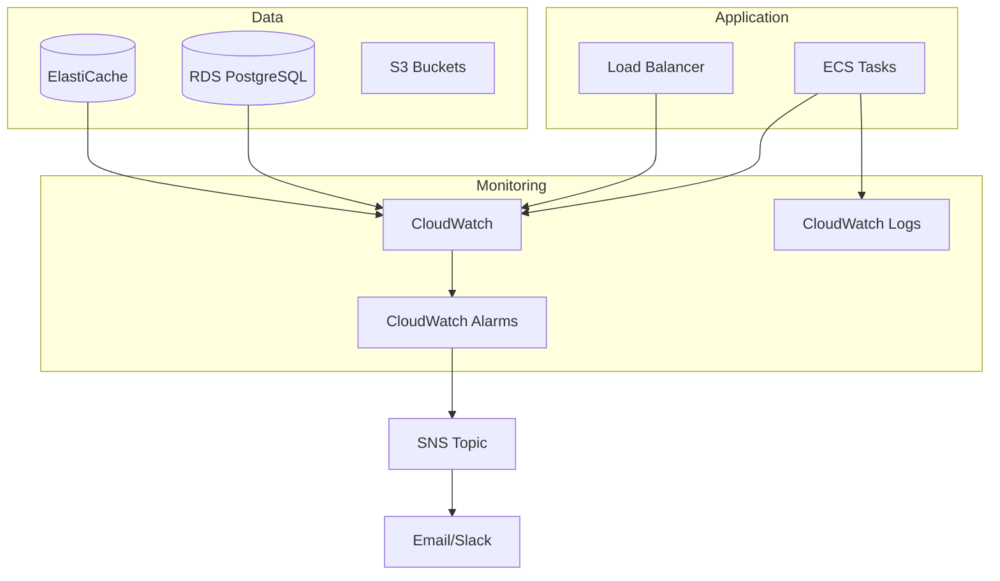

# Monitoring Guide

Guide for monitoring the Astro infrastructure using AWS CloudWatch and other tools.

## Overview



---

## Key Metrics

### ECS Fargate

| Metric | Normal | Warning | Critical |
|--------|--------|---------|----------|
| CPUUtilization | <70% | 70-85% | >85% |
| MemoryUtilization | <80% | 80-90% | >90% |
| RunningTaskCount | = Desired | < Desired | 0 |

### RDS PostgreSQL

| Metric | Normal | Warning | Critical |
|--------|--------|---------|----------|
| CPUUtilization | <70% | 70-85% | >85% |
| FreeStorageSpace | >5GB | 2-5GB | <2GB |
| DatabaseConnections | <80% max | 80-90% | >90% |
| ReadLatency | <5ms | 5-20ms | >20ms |
| WriteLatency | <10ms | 10-50ms | >50ms |

### ElastiCache Redis

| Metric | Normal | Warning | Critical |
|--------|--------|---------|----------|
| CPUUtilization | <70% | 70-85% | >85% |
| DatabaseMemoryUsagePercentage | <80% | 80-90% | >90% |
| CurrConnections | <1000 | 1000-5000 | >5000 |
| Evictions | 0 | 1-100 | >100 |

### Application Load Balancer

| Metric | Normal | Warning | Critical |
|--------|--------|---------|----------|
| HealthyHostCount | = Desired | < Desired | 0 |
| HTTPCode_Target_5XX_Count | <1% | 1-5% | >5% |
| TargetResponseTime | <500ms | 500ms-2s | >2s |
| RequestCount | Varies | High spike | DDoS pattern |

---

## CloudWatch Logs

### Log Groups

| Service | Log Group | Retention |
|---------|-----------|-----------|
| ECS API | `/ecs/astro-{env}-api` | 30 days |
| RDS | `/aws/rds/instance/astro-{env}-db/postgresql` | 7 days |
| ALB | S3 bucket | 90 days |

### View Logs

```bash
# Stream logs in real-time
aws logs tail /ecs/astro-dev-api --follow

# View last hour
aws logs tail /ecs/astro-dev-api --since 1h

# Search for errors
aws logs filter-log-events \
  --log-group-name /ecs/astro-dev-api \
  --filter-pattern "ERROR"
```

### Log Insights Queries

#### Error Rate
```sql
fields @timestamp, @message
| filter @message like /ERROR/
| stats count() as error_count by bin(5m)
```

#### Request Latency
```sql
fields @timestamp, request_id, duration_ms
| filter @message like /request completed/
| stats avg(duration_ms) as avg_latency,
        max(duration_ms) as max_latency
  by bin(5m)
```

#### Top Endpoints
```sql
fields @timestamp, method, path, status_code
| stats count() as requests by path
| sort requests desc
| limit 10
```

#### 5XX Errors
```sql
fields @timestamp, @message
| filter status_code >= 500
| stats count() by bin(1h)
```

---

## CloudWatch Alarms

### Recommended Alarms

#### ECS CPU High

```hcl
resource "aws_cloudwatch_metric_alarm" "ecs_cpu_high" {
  alarm_name          = "astro-${var.environment}-ecs-cpu-high"
  comparison_operator = "GreaterThanThreshold"
  evaluation_periods  = 2
  metric_name         = "CPUUtilization"
  namespace           = "AWS/ECS"
  period              = 300
  statistic           = "Average"
  threshold           = 80
  alarm_description   = "ECS CPU utilization is too high"

  dimensions = {
    ClusterName = "astro-${var.environment}-cluster"
    ServiceName = "astro-${var.environment}-api"
  }

  alarm_actions = [aws_sns_topic.alerts.arn]
  ok_actions    = [aws_sns_topic.alerts.arn]
}
```

#### RDS Storage Low

```hcl
resource "aws_cloudwatch_metric_alarm" "rds_storage_low" {
  alarm_name          = "astro-${var.environment}-rds-storage-low"
  comparison_operator = "LessThanThreshold"
  evaluation_periods  = 1
  metric_name         = "FreeStorageSpace"
  namespace           = "AWS/RDS"
  period              = 300
  statistic           = "Average"
  threshold           = 2000000000  # 2GB
  alarm_description   = "RDS free storage is low"

  dimensions = {
    DBInstanceIdentifier = "astro-${var.environment}-db"
  }

  alarm_actions = [aws_sns_topic.alerts.arn]
}
```

#### ALB 5XX Errors

```hcl
resource "aws_cloudwatch_metric_alarm" "alb_5xx_high" {
  alarm_name          = "astro-${var.environment}-alb-5xx-high"
  comparison_operator = "GreaterThanThreshold"
  evaluation_periods  = 2
  metric_name         = "HTTPCode_Target_5XX_Count"
  namespace           = "AWS/ApplicationELB"
  period              = 300
  statistic           = "Sum"
  threshold           = 10
  alarm_description   = "High 5XX error rate"

  dimensions = {
    LoadBalancer = aws_lb.api.arn_suffix
  }

  alarm_actions = [aws_sns_topic.alerts.arn]
}
```

#### No Healthy Hosts

```hcl
resource "aws_cloudwatch_metric_alarm" "alb_no_healthy_hosts" {
  alarm_name          = "astro-${var.environment}-no-healthy-hosts"
  comparison_operator = "LessThanThreshold"
  evaluation_periods  = 1
  metric_name         = "HealthyHostCount"
  namespace           = "AWS/ApplicationELB"
  period              = 60
  statistic           = "Minimum"
  threshold           = 1
  alarm_description   = "No healthy hosts available"

  dimensions = {
    LoadBalancer = aws_lb.api.arn_suffix
    TargetGroup  = aws_lb_target_group.api.arn_suffix
  }

  alarm_actions = [aws_sns_topic.alerts.arn]
}
```

---

## CloudWatch Dashboard

### Create Dashboard

```hcl
resource "aws_cloudwatch_dashboard" "main" {
  dashboard_name = "astro-${var.environment}"

  dashboard_body = jsonencode({
    widgets = [
      {
        type   = "metric"
        x      = 0
        y      = 0
        width  = 12
        height = 6
        properties = {
          title   = "ECS CPU & Memory"
          region  = var.aws_region
          metrics = [
            ["AWS/ECS", "CPUUtilization", "ClusterName", "astro-${var.environment}-cluster", "ServiceName", "astro-${var.environment}-api"],
            [".", "MemoryUtilization", ".", ".", ".", "."]
          ]
        }
      },
      {
        type   = "metric"
        x      = 12
        y      = 0
        width  = 12
        height = 6
        properties = {
          title   = "RDS Performance"
          region  = var.aws_region
          metrics = [
            ["AWS/RDS", "CPUUtilization", "DBInstanceIdentifier", "astro-${var.environment}-db"],
            [".", "FreeStorageSpace", ".", "."],
            [".", "DatabaseConnections", ".", "."]
          ]
        }
      },
      {
        type   = "metric"
        x      = 0
        y      = 6
        width  = 12
        height = 6
        properties = {
          title   = "ALB Requests & Errors"
          region  = var.aws_region
          metrics = [
            ["AWS/ApplicationELB", "RequestCount", "LoadBalancer", aws_lb.api.arn_suffix],
            [".", "HTTPCode_Target_5XX_Count", ".", "."],
            [".", "HTTPCode_Target_4XX_Count", ".", "."]
          ]
        }
      },
      {
        type   = "metric"
        x      = 12
        y      = 6
        width  = 12
        height = 6
        properties = {
          title   = "Redis Performance"
          region  = var.aws_region
          metrics = [
            ["AWS/ElastiCache", "CPUUtilization", "CacheClusterId", "astro-${var.environment}-redis"],
            [".", "DatabaseMemoryUsagePercentage", ".", "."],
            [".", "CurrConnections", ".", "."]
          ]
        }
      }
    ]
  })
}
```

---

## Alert Notifications

### SNS Topic Setup

```hcl
resource "aws_sns_topic" "alerts" {
  name = "astro-${var.environment}-alerts"
}

resource "aws_sns_topic_subscription" "email" {
  topic_arn = aws_sns_topic.alerts.arn
  protocol  = "email"
  endpoint  = "ops@example.com"
}
```

### Slack Integration

```bash
# Create SNS subscription with Lambda
# Lambda code sends to Slack webhook
```

---

## Health Checks

### API Health Endpoint

```bash
# Check API health
curl https://api.example.com/health
# Expected: {"status": "healthy"}

# Detailed health (internal)
curl https://api.example.com/health/detailed
# Shows: database, redis, disk, memory status
```

### Infrastructure Health

```bash
#!/bin/bash
# health-check.sh

echo "=== ECS ==="
aws ecs describe-services \
  --cluster astro-dev-cluster \
  --services astro-dev-api \
  --query 'services[0].{running:runningCount,desired:desiredCount}'

echo "=== RDS ==="
aws rds describe-db-instances \
  --db-instance-identifier astro-dev-db \
  --query 'DBInstances[0].DBInstanceStatus'

echo "=== Redis ==="
aws elasticache describe-cache-clusters \
  --cache-cluster-id astro-dev-redis \
  --query 'CacheClusters[0].CacheClusterStatus'

echo "=== ALB ==="
aws elbv2 describe-target-health \
  --target-group-arn $TARGET_GROUP_ARN \
  --query 'TargetHealthDescriptions[*].{Target:Target.Id,Health:TargetHealth.State}'
```

---

## Metrics Commands

### ECS Metrics

```bash
# CPU utilization
aws cloudwatch get-metric-statistics \
  --namespace AWS/ECS \
  --metric-name CPUUtilization \
  --dimensions Name=ClusterName,Value=astro-dev-cluster Name=ServiceName,Value=astro-dev-api \
  --start-time $(date -u -d '1 hour ago' +%Y-%m-%dT%H:%M:%SZ) \
  --end-time $(date -u +%Y-%m-%dT%H:%M:%SZ) \
  --period 300 \
  --statistics Average
```

### RDS Metrics

```bash
# Database connections
aws cloudwatch get-metric-statistics \
  --namespace AWS/RDS \
  --metric-name DatabaseConnections \
  --dimensions Name=DBInstanceIdentifier,Value=astro-dev-db \
  --start-time $(date -u -d '1 hour ago' +%Y-%m-%dT%H:%M:%SZ) \
  --end-time $(date -u +%Y-%m-%dT%H:%M:%SZ) \
  --period 300 \
  --statistics Maximum
```

### ALB Metrics

```bash
# Request count
aws cloudwatch get-metric-statistics \
  --namespace AWS/ApplicationELB \
  --metric-name RequestCount \
  --dimensions Name=LoadBalancer,Value=app/astro-dev-api/xxx \
  --start-time $(date -u -d '1 hour ago' +%Y-%m-%dT%H:%M:%SZ) \
  --end-time $(date -u +%Y-%m-%dT%H:%M:%SZ) \
  --period 300 \
  --statistics Sum
```

---

## Container Insights

Enable Container Insights for detailed ECS metrics:

```hcl
resource "aws_ecs_cluster" "main" {
  name = "astro-${var.environment}-cluster"

  setting {
    name  = "containerInsights"
    value = "enabled"
  }
}
```

**Additional Metrics**:
- Container-level CPU/Memory
- Network I/O
- Disk I/O
- Per-task metrics

---

## Performance Optimization

### Identify Slow Queries

Enable RDS Performance Insights:

```hcl
resource "aws_db_instance" "main" {
  performance_insights_enabled          = true
  performance_insights_retention_period = 7
}
```

### Monitor Redis Hit Rate

```bash
aws cloudwatch get-metric-statistics \
  --namespace AWS/ElastiCache \
  --metric-name CacheHitRate \
  --dimensions Name=CacheClusterId,Value=astro-dev-redis \
  --start-time $(date -u -d '1 hour ago' +%Y-%m-%dT%H:%M:%SZ) \
  --end-time $(date -u +%Y-%m-%dT%H:%M:%SZ) \
  --period 300 \
  --statistics Average
```

---

## Monitoring Checklist

### Daily

- [ ] Check CloudWatch dashboard
- [ ] Review any triggered alarms
- [ ] Verify ECS task count matches desired
- [ ] Check API health endpoint

### Weekly

- [ ] Review error logs
- [ ] Check RDS storage growth
- [ ] Review CloudFront cache hit ratio
- [ ] Check cost trends

### Monthly

- [ ] Analyze performance trends
- [ ] Review and update alarm thresholds
- [ ] Test disaster recovery
- [ ] Validate backup integrity

---

*Last updated: 2025-12-26*
